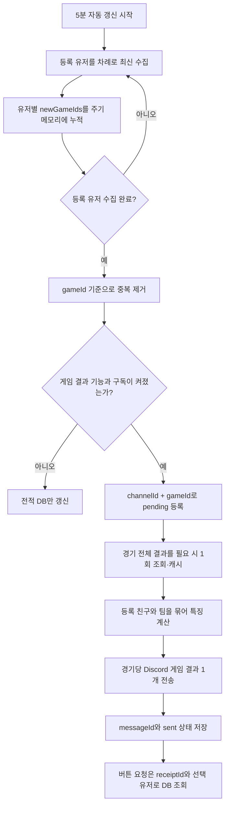

# 이터널 리턴 게임 결과 알림 설계·구현 TODO

작성일: 2026-09-21  
수정일: 2026-09-22

기준 문서:

- [전적 수집·DB 설계 보고서](eternal-return-data-collection-report.md)
- [기존 이터널 리턴 구현 TODO](eternal-return-implementation-todo.md)
- [공식 Open API 레퍼런스](https://developer.eternalreturn.io/static/media/OpenAPI_KR_20260724.html)

상태: **설계 완료, 구현 1단계 완료**

## 1. 목표

자동 수집 대상으로 등록한 유저의 새 게임이 발견되면 Discord 채널에 **게임 결과**를 보낸다. 기본 메시지는 결과와 중요한 특징만 짧게 보여주고, 전투·팀 기여·크레딧·행동·빌드 상세는 버튼을 눌러 확인한다.

기존 전적 사이트처럼 많은 수치를 한 화면에 나열하는 대신 다음 질문에 바로 답하는 것이 목표다.

- 이번 게임의 결과는 어땠는가?
- 전투와 팀 기여에서 눈에 띈 행동은 무엇인가?
- 크레딧을 어디서 벌고 어디에 썼는가?
- 코인 토스 같은 특성이 실제로 얼마의 이득을 줬는가?
- 할인 쿠폰을 골랐다면 어떤 고급 재료에 얼마를 실제로 썼는가?
- 평범하지 않은 재미있는 기록이 있었는가?

## 2. 알림 대상과 전송 원칙

- 로컬 관리 도구로 자동 수집에 등록된 유저 중 게임 결과 알림을 켠 유저만 대상으로 한다.
- 5분 자동 갱신의 **최신 수집에서 처음 발견한 경기**만 알린다.
- 최초 100경기 백필과 수동 과거 페이지 수집은 알리지 않는다.
- 기능을 처음 켤 때 기존 DB 경기는 발송 완료 기준선으로 등록해 과거 알림이 쏟아지지 않게 한다.
- 등록 유저별 수집이 끝날 때마다 바로 보내지 않는다. 한 자동 갱신 주기가 모두 끝난 뒤 새 경기들을 `gameId`로 묶는다.
- 같은 채널의 같은 `gameId` 결과 알림은 한 번만 발송한다. 같은 스쿼드의 등록 친구 3명이 각각 새 경기로 감지되어도 팀 결과 알림 하나만 만든다.
- 등록 친구가 같은 게임의 서로 다른 팀에 있었다면 한 메시지 안에서 팀별로 나눠 표시한다.
- 한 주기에 새 경기가 여러 개면 경기 시각이 오래된 것부터 전송한다. 너무 많은 경기가 한꺼번에 발견되면 최대 개별 발송 수를 두고 나머지는 묶음 요약으로 보낸다.
- API `userId`가 회전해도 `gameId + channelId` 발송 키에는 영향이 없다. 닉네임 변경으로 기존 UID 조회가 깨진 경우에는 현재 닉네임 조회 결과로 선수 연결만 갱신한다.
- 알림 채널과 기능 설정은 엔드필드·주식 알림과 독립시킨다.

제안 설정:

```dotenv
ER_RECEIPTS_ENABLED=false
ER_RECEIPT_CHANNEL_ID=
ER_RECEIPT_MAX_PER_CYCLE=3
```

미니PC 운영 환경은 기존 방침대로 `ER_ENABLED=false`이면 게임 결과 모듈도 로드하거나 등록하지 않는다.

## 3. Discord 기본 게임 결과 예시

기본 Embed는 휴대폰에서도 한 화면에 중요한 결과가 들어오도록 구성한다.

```text
┌─────────────────────────────────────┐
│ 🎮 홉빵맨 게임 결과                    │
│ 니아 · 랭크/Squad · 09.21 22:14      │
├─────────────────────────────────────┤
│ 🥈 2위 · RP +34 · 21분 08초           │
│ K/D/A 5/2/8 · 팀킬 16                 │
│                                      │
│ ⚔️ 가한 피해 28,202                   │
│ 🛡️ 받은 피해 19,410                   │
│ 🐺 야생동물 피해 84,320 · 37마리       │
│                                      │
│ 💰 획득 1,661 · 사용 1,580 · 잔액 +81  │
├─────────────────────────────────────┤
│ ✨ 이번 경기의 특징                   │
│ • 코인 토스로 166 크레딧 획득          │
│ • 아군 부활 1회 · 부활 비용 250        │
│ • 카메라 5개 설치 · 시야 기여 27       │
│ • 트리플 킬 1회                       │
└─────────────────────────────────────┘

[⚔️ 전투] [❤️ 팀 기여] [💰 크레딧]
[👁️ 행동] [🛠️ 빌드]
```

표시 원칙:

- 값이 0이거나 API에서 누락된 세부 항목은 기본 게임 결과에서 숨긴다.
- `이번 경기의 특징`은 최대 4개만 표시한다.
- 1등·TOP 3, 높은 피해, 다중 킬, 부활, 클러치, 코인 토스, 특이 행동처럼 이야기할 만한 항목을 우선한다.
- RP는 `mmrGain`이 있을 때만 표시한다. `mmrBefore`·`mmrAfter`는 일부 API 사용자에게만 제공되므로 필수값으로 취급하지 않는다.
- 전체 유저 평균이나 근거 없는 잘함·못함 평가는 넣지 않는다.

### 등록 친구 3명이 같은 스쿼드인 경우

세 사람을 각각 알리지 않고 다음처럼 하나의 팀 결과 화면으로 합친다.

```text
┌──────────────────────────────────────────┐
│ 🎮 친구 스쿼드 게임 결과                    │
│ 랭크/Squad · 09.22 22:14 · 21분 08초      │
├──────────────────────────────────────────┤
│ 🥈 2위 · 팀킬 14 · 팀 피해 81,452          │
│                                           │
│ 홉빵맨   · 니아   5/2/8 · 피해 28,202      │
│ 홍어심슨 · 리오   3/3/7 · 피해 21,430      │
│ 재자명지 · 자히르 6/1/5 · 피해 31,820      │
│                                           │
│ ✨ 코인 토스 합계 336 · 아군 부활 2회        │
└──────────────────────────────────────────┘

[상세 유저 선택 ▼]
[⚔️ 전투] [❤️ 팀 기여] [💰 크레딧]
[👁️ 행동] [🛠️ 빌드]
```

유저 선택 메뉴에서 한 명을 고른 뒤 상세 버튼을 누르면 그 선수의 상세 결과를 임시 응답으로 보여준다. 등록 친구가 한 명만 포함된 게임은 개인 결과 화면을 사용한다.

## 4. 상세 버튼 예시

자동 알림 메시지는 그대로 유지한다. 누구나 버튼을 누를 수 있고, 상세 결과는 누른 사람에게만 임시 응답으로 보여준다. 이렇게 하면 여러 사람이 버튼을 눌러도 공개 게임 결과 화면이 서로 바뀌지 않는다.

상세 버튼은 메모리 세션에 의존하지 않고 `receiptId`로 DB를 조회한다. 봇이 재시작된 뒤에도 동작하며, 원본 결과 메시지가 삭제됐거나 DB에 없을 때만 만료 안내를 보낸다.

### `⚔️ 전투`

```text
⚔️ 전투 상세

K/D/A              5 / 2 / 8
팀킬                16
가한 피해           28,202
 ├ 기본 공격        8,410
 ├ 스킬            18,972
 ├ 아이템 효과         320
 ├ 직접 피해           120
 ├ 고유 효과           252
 └ 함정                128
받은 피해           19,410
보호막 피해 흡수      5,310
가한 CC 시간          14.8초

더블 킬 2회 · 트리플 킬 1회
클러치 1회 · 터미네이트 1팀
```

피해 유형 표시 원칙:

- `기본 공격`, `스킬`, `아이템 효과`, `직접 피해`, `고유 효과`, `함정`은 각각 API의 `damageToPlayer_basic`, `damageToPlayer_skill`, `damageToPlayer_itemSkill`, `damageToPlayer_direct`, `damageToPlayer_uniqueSkill`, `damageToPlayer_trap`을 그대로 표시한다.
- 값이 0이거나 누락된 피해 유형은 숨긴다.
- `고유 효과`를 `특성 피해`라고 표시하지 않는다. 공식 API는 피해를 주는 특성이 어느 유형에 포함되는지와 특성별 피해량을 제공하지 않는다.
- 총피해와 세부 유형 합계가 일치하지 않는 표본은 임의로 어느 유형에 더하지 않는다. 차이는 검증 후 필요할 때만 `분류되지 않은 피해`로 표시한다.
- `damageToPlayer_Shield`는 다른 플레이어의 보호막에 가한 피해이므로 체력 대상 피해 유형과 분리해서 표시한다.

`ccTimeToPlayer`는 검색 유저가 다른 플레이어에게 **가한 총 CC 시간**이다. 받은 CC 시간이 아니다. 공식 API는 기절·에어본·속박·슬로우·침묵 등 어떤 상태가 합산되는지와 상태별 시간을 공개하지 않으므로, 화면에서는 `가한 CC 시간`으로만 표시하고 하드 CC 또는 소프트 CC로 세분하거나 평가하지 않는다.

### `❤️ 팀 기여`

```text
❤️ 팀 기여

지원
아군 회복             8,420
아군 부활             1회 · 250 크레딧
아군 원격 드론 지원      350 크레딧

시야 지원
시야 기여도 27
감시·망원 카메라 설치 5 · 적 카메라 제거 3
보안 콘솔(CCTV) 2회
정찰 드론 2회 · EMP 드론 1회
```

보호막 표시 원칙:

- `damageOffsetedByShield_Player`는 해당 플레이어가 자신의 보호막으로 다른 플레이어의 피해를 흡수한 양이므로 전투 상세의 `보호막 피해 흡수`에 사용한다.
- `protectAbsorb`는 공식 문서에서 `보호막이 흡수/방어한 피해량`으로만 정의하며, 본인과 아군 중 누구에게 제공한 보호막인지 구분하지 않는다.
- 따라서 `protectAbsorb`를 `아군에게 제공한 보호막` 또는 `팀 보호량`으로 표시하지 않는다. 대상 의미를 실제 응답이나 추가 공식 자료로 확정하기 전에는 팀 기여 화면에서 제외한다.
- `teamRecover`는 공식 정의가 다른 플레이어에게 제공한 회복량이므로 `아군 회복`으로 표시할 수 있다.

팀 기여 항목의 출처:

- `creditRevivedOthersCount`: 전송 콘솔로 아군을 부활시킨 횟수.
- `transferConsoleFromRevivalUseVFCredit`: 전송 콘솔 부활에 사용한 크레딧. 실제 응답 별칭도 함께 처리한다.
- `remoteDroneUseVFCreditAlly`: 아군을 위해 원격 드론 전송에 사용한 크레딧.
- `viewContribution`: 시야 기여도 점수. 공식 API는 점수 계산식은 제공하지 않는다.
- `addSurveillanceCamera`, `addTelephotoCamera`: 감시·망원 카메라 설치 횟수.
- `removeSurveillanceCamera`, `removeTelephotoCamera`: 적 카메라 제거 횟수.
- `useSecurityConsole`: CCTV를 활성화하는 보안 콘솔 사용 횟수. 활성화 시간이나 고유 지역 수가 아니라 사용 횟수로 표시한다.
- `useReconDrone`, `useEmpDrone`: 정찰·EMP 드론 사용 횟수.

### `💰 크레딧`

```text
💰 크레딧 명세

총 획득              1,679
 ├ 시간 경과           685
 ├ 야생동물            302
 ├ 돌연변이             40
 ├ 보스                 18
 ├ 플레이어 킬          90
 ├ 어시스트             70
 ├ 현상금               100
 ├ 최저 크레딧 보정      100
 ├ LUMI 도난 경보        30
 ├ 보리(B0-R1)          25
 ├ 코인 토스           166
 └ 판매·교환             53

총 사용              1,530
 ├ 재료 구매          1,050
 ├ 원격 드론 구매(본인) 280
 └ 전술 스킬 강화 모듈   200

수지                 +149
```

`creditSource.TraitSkillCoinToss`를 코인 토스 수익으로 사용한다. 실제 게임 `65304173`에서 코인 토스를 사용한 `홉빵맨`은 166, `홍어심슨`은 170을 반환했다. `bonusCoin`은 이 값과 무관하므로 사용하지 않는다.

할인 쿠폰은 특성 코드 `7210801`로 선택 여부를 확인한다. API는 할인 후 결제액을 `crUseTreeOfLife`, `crUseMeteorite`, `crUseMythril`, `crUseForceCore`, `crUseVFBloodSample`, `crUseActivationModule`과 `kioskFromMaterialUseVFCredit`에 기록하지만, **할인으로 절약한 총액을 별도 필드나 `creditSource` 키로 제공하지 않는다.** 실제 경기 `65589901`에서 할인 쿠폰 사용자는 생명의 나무 180, 포스 코어 330, 재료 구매 합계 510을 반환했고 같은 경기의 미사용자는 각각 200, 350을 반환했다. 같은 경기에서 전술 스킬 강화 모듈도 미사용자는 200, 할인 쿠폰 사용자는 180을 반환했다. 현재 규칙에서는 구매당 20 크레딧 할인이 확인되지만, 패치별 정상 가격과 구매 품목을 대조할 수 있을 때만 절약액을 계산한다. 검증이 불완전하면 `할인 쿠폰 사용 · 실제 결제 510`처럼 결제액만 표시하며, `gimmickHospitalDiscountRate`는 시즌 병원 기믹이므로 할인 쿠폰 값으로 사용하지 않는다.

`remoteDroneUseVFCreditMySelf`와 `creditSource.KioskRemoteDroneMySelf`는 감시 카메라나 정찰·EMP 드론만의 구매액이 아니라, **원격 드론으로 본인에게 요청한 모든 아이템의 총비용**이다. `remoteDroneUseVFCreditAlly`는 아군에게 요청한 총비용이다. `itemTransferredDrone`에는 요청한 아이템 코드가 들어오므로 언어 데이터로 이름을 바꾸고, 같은 코드가 반복되면 수량으로 묶어 표시한다. 다만 각 아이템의 개별 결제액·요청 시각·본인/아군 수령 구분은 제공되지 않으므로 추측하지 않는다. 감시 카메라 설치와 정찰·EMP 드론 실제 사용 횟수는 각각 `addSurveillanceCamera`, `addTelephotoCamera`, `useReconDrone`, `useEmpDrone`으로 별도 표시한다.

실제 경기의 원격 드론 상세 예시:

```text
원격 드론 구매(본인) 245
 ├ 라이터 1개
 ├ 나막신 1개
 ├ 후라이드 치킨 2개
 ├ 망원 카메라 2개
 ├ 정찰 드론 4개
 └ EMP 드론 1개
```

위 품목은 `itemTransferredDrone`의 실제 코드 목록을 한글 이름과 수량으로 묶은 것이다. 총액 245는 API 그대로 표시하지만 품목별 가격은 제공되지 않으므로 각 줄에 임의로 배분하지 않는다. Discord 기본 화면에는 `원격 드론 구매(본인) 245 · 6종 11개`처럼 요약하고, 크레딧 상세 화면에서 전체 품목을 표시한다.

통합 필드와 상세 출처를 함께 더하지 않는다. 총계는 `totalGainVFCredit`을 단일 기준으로 사용하며, 상세 항목은 총계를 다시 계산하기 위한 값이 아니라 설명용 분해값으로만 사용한다.

정합성 규칙:

- 화면의 `총 획득`은 언제나 API의 `totalGainVFCredit`, `총 사용`은 `totalUseVFCredit`을 그대로 사용한다.
- 상세 분류는 서로 겹치지 않는 필드나 `creditSource` 키만 한 번씩 사용한다. 집계 필드와 그 구성 필드를 함께 더하지 않는다.
- 알려진 상세 분류의 합을 총액에서 뺀 양수 잔여값은 `미분류`로 표시한다. 잔여값이 음수이면 중복 집계 오류이므로 결과 전송을 막고 기록한다.
- 패치로 처음 보는 `creditSource` 키가 생기면 원본을 보존하고 `미분류`에 포함한다. 의미를 확인한 뒤 표시명만 추가하므로 총액은 바뀌지 않는다.
- 경기별로 `상세 분류 합 + 미분류 = 총 획득` 및 `사용 분류 합 + 미분류 = 총 사용`을 검증한다. 소수 크레딧 원본은 합산 후 API 총액 기준으로 정규화한다.

획득 크레딧 표시 원칙:

- `crGetTimeElapsed`: 시간 경과 지급.
- `crGetPhaseStart`: 페이즈 전환 시 시스템이 지급한 크레딧. 루미아 섬의 일반적인 시간 경과 수익과 구분하며, 모드별 보정 성격의 값이므로 0보다 클 때만 `페이즈 보정`으로 표시한다.
- `crGetAnimal`: 일반 야생동물만의 값이 아니라 일반 동물·보스·공격 드론 등 비변이 PvE 처치 수익을 합친 상위 집계값이다. 세부 화면에서는 직접 `야생동물`로 표시하거나 다른 처치 필드와 합산하지 않고 교차 검증에만 사용한다.
- `야생동물` 상세값은 `creditSource`의 `KillChicken`, `KillBat`, `KillBoar`, `KillWildDog`, `KillWolf`, `KillBear`, `KillRaven`만 합산한다.
- `crGetMutant`: 변이 닭·변이 멧돼지·변이 들개·변이 늑대·변이 곰·변이 박쥐·변이 까마귀 등 변이체로 출현한 일반 야생동물의 처치 수익. 알파·오메가·감마·위클라인 같은 에픽 몬스터 수익은 포함하지 않는다.
- 실제 경기 `65520372`에서 `crGetMutant=129`는 `KillMutant*` 7종의 합과 일치했고, 같은 경기의 알파 3·위클라인 5 크레딧은 각각 별도 필드에 기록됐다. 자색 안개 변이체의 `KillPurpleMutant*` 수익도 `crGetMutant`에 포함되는 것을 확인했다.
- `killAlphaGainVFCredit`, `killOmegaGainVFCredit`, `killGammaGainVFCredit`, `killWicklineGainVFCredit`: 알파·오메가·감마·위클라인 처치 수익. 0보다 큰 값만 합쳐 `보스`로 표시하고, 상세 보기에서는 몬스터별로 나눈다.
- 실제 경기 `65520372`의 일반 야생동물 출처 합은 187이고 보스 출처 합은 8이며, `crGetAnimal=195`는 두 값의 합이었다. 경기 `65522032`에서는 일반 야생동물 135와 공격 드론 6의 합이 `crGetAnimal=141`이었다. 따라서 `crGetAnimal`과 보스·오브젝트를 동시에 더하면 중복된다.
- `crGetKill`, `crGetAssist`: 플레이어 킬의 기본 보상과 어시스트 수익.
- `crGetCreditBonus`: 팀에서 보유 크레딧이 가장 적은 플레이어에게 시스템이 추가 지급한 따라잡기 보정 크레딧. 플레이어가 특정 행동으로 번 수입은 아니다.
- `itemShredderGainVFCredit`, `kioskExchangeCredit`: 아이템 판매 또는 키오스크·루미 교환 수익.
- `killItemBountyGainVFCredit`: 플레이어 시체에서 획득한 현상금 크레딧. 기본 킬 보상인 `crGetKill`과 합치지 않고 `현상금`으로 별도 표시한다.
- 실제 `creditSource`에서는 `ItemBounty`와 `ItemBountyByItemCode`의 합이 `killItemBountyGainVFCredit`에 대응했다. 두 내부 키의 차이를 사용자에게 추측해서 설명하지 않고 한 항목으로 합친다.
- 2026-09-22 최근 60개 유저 경기 표본 중 33개에서 현상금 획득이 확인됐다. `playerKill=0`, `crGetKill=0`이지만 현상금이 10인 응답도 있어, 현상금은 처치자에게 고정되는 값이 아니라 실제 획득한 플레이어의 기록으로 취급한다.
- `crGetByGuideRobot`: 공격 가능한 도난 경보 상태의 안내 로봇 LUMI에게서 획득한 크레딧. 0보다 클 때 `LUMI 도난 경보`로 표시한다.
- `damageToGuideRobot`: LUMI에게 가한 총 피해. 크레딧 획득량과는 별개이며 활동 기록이나 경기 특징에 표시한다.
- `useGuideRobot`: LUMI에 채널링한 횟수. 공격 횟수나 홀로그램 크레딧을 주운 횟수로 해석하지 않는다.
- API는 LUMI에게서 얻은 총 크레딧을 제공하지만 홀로그램을 몇 개 주웠는지는 제공하지 않는다. 패치와 모드에 따라 홀로그램당 가치가 달라질 수 있으므로 총액에서 개수를 역산하지 않는다.
- 시즌 9 마츠리에서 추가된 족제비형 로봇의 공식 명칭은 `보리(B0-R1)`이다. `creditSource`의 `BoriIdleDropInterval`, `BoriStartRunaway`, `BoriRunawayDropInterval`, `BoriDeath`를 합쳐 `보리(B0-R1)` 수익으로 표시한다.
- 보리 상세를 펼치면 위 키를 각각 `산책 중 드롭`, `도주 시작`, `도주 중 드롭`, `처치`로 표시한다. 이 한글명은 실제 응답 키와 공식 보리 행동 설명을 결합한 해석이므로 원본 키도 보존한다.
- `getBoriReward`는 보리가 떨어뜨린 상자의 등급별 횟수이며 크레딧 수익이 아니다. 상자 내용물을 실제로 획득했다는 뜻도 아니므로 별도의 보상 기록으로 표시한다.
- API에는 보리에게 가한 피해량을 나타내는 전용 필드가 없다. `damageToGuideRobot`은 LUMI에게 가한 피해만 뜻하므로 보리 피해로 재사용하거나 보리 크레딧에서 피해량을 역산하지 않는다.
- 2026-09-22 등록 유저 7명의 최근 60개 유저 경기 응답을 확인했으며, 네 종류의 `Bori*` 크레딧 키를 모두 실제로 확인했다. 이 중 `getBoriReward`가 기록된 응답은 4개였다.
- `creditSource`의 알려진 특성 키는 별도 출처로 표시한다. 현재 검증된 `TraitSkillCoinToss`는 `코인 토스`로 표시한다.
- 총 획득액에서 중복 없는 알려진 출처를 뺀 값이 남을 때만 `미분류`로 표시한다. `기타`라는 모호한 명칭은 사용하지 않으며, 원본 `creditSource` 키는 향후 명칭 추가를 위해 DB에 보존한다.

### `👁️ 행동`

```text
👁️ 활동 기록

전술 스킬 블링크 5회 · 하이퍼루프 6회
LUMI에게 가한 피해 4,812

보안 콘솔 4회 · 낚시 3회
균열 진입 2회 · 승리 2회 · 강화 균열 1회
큐브 2개 · 보리 보상 상자 2개
```

모든 항목이 0이면 `기록된 특별 행동이 없습니다.`라고 표시한다.

활동 기록 표시 원칙:

- 0보다 큰 값만 표시하며, 기본 화면은 최대 5줄로 제한한다. 나머지는 상세 보기에서 보여준다.
- `tacticalSkillGroup`과 언어 데이터를 이용해 블링크·재생의 바람 등 선택한 전술 스킬의 이름을 확인하고, `tacticalSkillUseCount`를 총 사용 횟수로 표시한다. `tacticalSkillLevel`은 최종 레벨이며 사용 횟수에 더하지 않는다.
- 캐릭터 Q/W/E/R과 무기 스킬의 사용 횟수는 API가 제공하지 않는다. `skillLevelInfo`와 `skillOrderInfo`는 각각 최종 스킬 레벨과 레벨업 순서이므로 사용 횟수로 해석하지 않는다. 피해 유형이나 재사용 대기시간으로 사용 횟수를 역산하지 않는다.
- `enterDimensionRift`, `winFromDimensionRift`: 일반·강화 균열을 합친 진입 및 승리 횟수.
- `enterDimensionEmpoweredRift`, `winFromDimensionEmpoweredRift`: 위 합계에 이미 포함된 강화 균열 횟수이므로 별도로 더하지 않고 세부 설명에만 사용한다.
- `enterTurbulentRift`: 난류 진입 횟수.
- `sumGetBuffCube`: 획득한 큐브 총수. `getBuffCubeRed`, `Purple`, `Green`, `Gold`, `SkyBlue`는 색상별 상세이며 총수에 다시 더하지 않는다.
- `getBoriReward`: 보리가 떨어뜨린 보상 상자 수. 등급별 값을 합산하되 실제 내용물 획득으로 표현하지 않는다.
- `activeInstallation`: 환경 변수 사용 횟수. 데이터 테이블로 ID의 이름을 확인할 수 있을 때만 한글 이름을 표시한다.
- `useGadget`: `<가젯 스킬 ID, 사용 횟수>` 기록이며 구매 목록이 아니다. 한 번 이상 사용한 가젯은 확인할 수 있지만, 구매·획득 후 한 번도 사용하지 않은 가젯은 이 값으로 확인할 수 없다.
- 현재 가젯 스킬 ID는 `8300101` 키오스크 호출기, `8300201` 휴대용 VLS, `8300301` 사냥꾼의 솥단지, `8300401` ORB - 감시, `8310201` 키트 - 강풍지대, `8310301` 휴대용 안전지대, `8310501` CNOT 게이트로 표시한다. 이름은 고정 문자열 대신 한국어 언어 데이터에서 읽는다.
- `gimmickAppleDropped`, `gimmickDrumUseCount`, `gimmickDrumAttackCount`, `gimmickDrumDroppedHitCount`, `gimmickEvidenceLockerCount`, `gimmickEvidenceLockerItem`, `gimmickHospitalDiscountRate`, `gimmickGrandfatherClockUseCount`: 시즌별 기믹 기록. 해당 시즌에서 0보다 큰 값만 `시즌 활동` 상세에 표시한다.

### `🛠️ 빌드`

```text
🛠️ 최종 빌드

실험체 니아 · 레벨 20
무기 숙련도 16 · 전술 스킬 레벨 3
루트 5212 · 초보 니아 안정 루트
추천 1,284회(조회 시점) · 시작 호텔

장비
페일노트-진홍 / 길리 슈트 / 퀸드 아이 / ...

특성
아드레날린 / 코인 토스 / ...
코인 토스 효과: +166 크레딧

스킬 레벨업 순서
Q → W → E → Q → Q → R → Q → W → W → R → W → W → E → E → R → E → E
```

`skillOrderInfo`를 순서 번호로 정렬해 경기 중 실제로 스킬 포인트를 투자한 순서를 표시한다. 스킬 코드는 캐릭터 스킬 데이터와 언어 데이터를 이용해 `Q/W/E/R/T` 또는 스킬 이름으로 변환한다. 이 값은 스킬 사용 횟수가 아니며, 추천 루트의 `skillPath`와도 구분한다. 값이 없거나 코드 매핑에 실패한 항목은 임의로 추정하지 않고 원본 코드로 표시한다.

스킬 순서가 길면 `1~10`, `11~마지막` 두 줄로 나누며, 해당 모드나 과거 경기에서 `skillOrderInfo`가 없으면 항목을 숨긴다.

경기의 `routeIdOfStart`로 `/v1/weaponRoutes/recommend?routeId={routeId}`를 조회해 `title`과 현재 시즌 추천 수 `v2Like`를 표시한다. `v2Like`는 경기 당시의 고정값이 아니라 조회 시점 값이므로 `추천 N회(조회 시점)`으로 표기한다. 필요하면 상세 보기에서 누적 추천 수 `v2AccumulateLike`도 표시할 수 있다.

루트는 수정·비공개·삭제될 수 있으므로 조회 결과가 없으면 `루트 {id}`만 표시한다. 같은 루트를 반복 호출하지 않도록 루트 ID별 메타데이터를 24시간 캐시하며, 새로 발견된 루트만 공통 요청 큐를 통해 1회 조회한다. 게임 결과 알림은 루트 조회 실패 때문에 전체 전송이 실패하지 않게 한다.

## 5. 수집할 필드

### 이미 저장하는 필드

- 게임·시즌·모드·실험체·순위·시각
- K/D/A·팀킬·RP 변화
- 플레이어 피해·받은 피해·야생동물 피해
- 회복·아군 회복·보호막·CC 시간
- 야생동물 처치·종류별 처치
- 시야 기여·감시 카메라 설치/제거
- 장비·특성·루트·시작/사망 지역
- 전술 스킬·팀·사전 구성 정보

### 독립 숫자 열로 추가할 필드

화면 표시, 특징 판정, 주간 집계에 자주 사용할 값은 SQL 숫자 열로 저장한다.

- `damageToPlayer_basic`, `damageToPlayer_skill`, `damageToPlayer_itemSkill`, `damageToPlayer_direct`, `damageToPlayer_uniqueSkill`, `damageToPlayer_trap`
- `damageOffsetedByShield_Player`, `damageOffsetedByShield_Monster`
- `addTelephotoCamera`, `removeTelephotoCamera`
- `useReconDrone`, `useEmpDrone`, `useHyperLoop`, `useSecurityConsole`
- `totalDoubleKill`, `totalTripleKill`, `totalQuadraKill`, `totalExtraKill`
- `clutchCount`, `terminateCount`, `teamElimination`, `teamDown`
- `totalGainVFCredit`, `totalUseVFCredit`
- `crGetAnimal`, `crGetMutant`, `crGetPhaseStart`, `crGetKill`, `crGetAssist`, `crGetTimeElapsed`, `crGetCreditBonus`, `crGetByGuideRobot`
- `killAlphaGainVFCredit`, `killOmegaGainVFCredit`, `killGammaGainVFCredit`, `killWicklineGainVFCredit`
- `itemShredderGainVFCredit`, `kioskExchangeCredit`, `killItemBountyGainVFCredit`
- `remoteDroneUseVFCreditMySelf`, `remoteDroneUseVFCreditAlly`
- `transferConsoleFromRevivalUseVFCredit`와 실제 응답 별칭 `kioskFromRevivalUseVFCredit`
- `creditRevivalCount`, `creditRevivedOthersCount`
- `tacticalSkillUpgradeUseVFCredit`
- `crUseRemoteDrone`, `crUseUpgradeTacticalSkill`, `crUseTreeOfLife`, `crUseMeteorite`, `crUseMythril`, `crUseForceCore`, `crUseVFBloodSample`, `crUseActivationModule`, `crUseRootkit`
- `fishingCount`, `useEmoticonCount`, `useGuideRobot`, `damageToGuideRobot`
- `enterDimensionRift`, `enterDimensionEmpoweredRift`, `winFromDimensionRift`, `winFromDimensionEmpoweredRift`, `enterTurbulentRift`
- `getBuffCubeRed`, `getBuffCubePurple`, `getBuffCubeGreen`, `getBuffCubeGold`, `getBuffCubeSkyBlue`, `sumGetBuffCube`
- `gimmickAppleDropped`, `gimmickDrumUseCount`, `gimmickDrumAttackCount`, `gimmickDrumDroppedHitCount`, `gimmickHospitalDiscountRate`, `gimmickGrandfatherClockUseCount`
- `bestWeaponLevel`, `mmrAvg`, `skinCode`

### JSON으로 보관할 필드

키 종류가 많거나 패치로 늘어날 가능성이 있는 값은 JSON으로 저장한다.

- `creditSource`: 코인 토스 포함 모든 크레딧 출처
- `totalVFCredit`/실제 응답 `totalVFCredits`: 분 단위 획득 크레딧
- `usedVFCredit`/실제 응답 `usedVFCredits`: 분 단위 사용 크레딧
- `masteryLevel`, `skillLevelInfo`, `skillOrderInfo`
- `foodCraftCount`, `beverageCraftCount`, `airSupplyOpenCount`
- `getBoriReward`: 보리가 떨어뜨린 상자의 등급별 횟수
- `activeInstallation`, `useGadget`
- `gimmickEvidenceLockerCount`, `gimmickEvidenceLockerItem`
- `itemTransferredConsole`, `itemTransferredDrone`
- 루트 ID별 `title`, `v2Like`, `v2SeasonId`, `v2AccumulateLike`, `updateDtm`과 조회 시각
- 날씨와 환경 기믹처럼 패치에 따라 늘어나는 선택 필드

API 문서와 실제 응답에서 단수·복수나 접두어가 다른 필드가 있다. 저장 경계에서 별칭을 정규화하고, 원본 출처 JSON도 함께 남긴다.

### 제외하거나 참고용으로만 보관할 필드

- `killer*`, `killDetail*`, `causeOfDeath*`, `placeOfDeath*`는 공식 문서에서 레거시이며 해석 지원이 중단됐다. 기본 게임 결과 판정에는 사용하지 않는다.
- 사용 중단된 전투 지역 필드는 신규 화면에 사용하지 않는다.
- 코발트·스쿼드 럼블 전용 필드는 해당 모드를 지원하기 전까지 기본 게임 결과에서 제외한다.

## 6. DB 설계

### 경기 상세 확장

기존 `er_games`에 자주 조회하는 숫자 열과 다음 JSON 열을 추가한다.

```text
credit_source_json
credit_timeline_json
used_credit_timeline_json
mastery_levels_json
skill_order_json
receipt_details_json
```

기존 행은 `NULL`로 유지한다. 누락을 0으로 바꾸지 않으며, 같은 경기의 새 API 응답에 값이 있으면 갱신한다.

### 게임 결과 발송 상태

새 테이블 `er_game_receipts`를 추가한다.

| 열 | 용도 |
|---|---|
| `receipt_id` | Discord 버튼에서 사용할 짧은 내부 ID |
| `game_id` | 대상 경기 |
| `status` | `pending`, `sending`, `sent`, `failed`, `suppressed` |
| `detected_at` | 새 경기 발견 시각 |
| `sent_at` | 발송 성공 시각 |
| `channel_id`, `message_id` | 기존 게임 결과 확인과 운영 진단 |
| `attempt_count`, `last_error` | 실패 재시도 |
| `created_at`, `updated_at` | 상태 관리 |

고유 키는 `(channel_id, game_id)`로 둔다. 같은 경기를 구독하는 유저가 몇 명이든 채널당 결과 알림은 하나만 생긴다.

게임 결과에 포함할 선수는 자식 테이블 `er_game_receipt_players`에 보관한다.

| 열 | 용도 |
|---|---|
| `receipt_id` | 부모 결과 알림 |
| `game_id`, `user_id` | 선수의 해당 경기 연결 |
| `nickname`, `team_number` | 화면 표시와 팀 묶음 |
| `is_monitored` | 자동 수집 등록 유저 여부 |
| `created_at`, `updated_at` | 상태 관리 |

고유 키는 `(receipt_id, user_id)`로 둔다. 경기 전체 조회 응답은 같은 `gameId`를 다시 조회하지 않도록 경기 단위로 캐시한다.

`sending` 상태에서 프로세스가 중단되면 다음 시작 때 `pending`으로 되돌려 재시도한다. Discord 전송 성공 후 DB 기록 전에 중단되는 아주 짧은 구간의 중복 가능성을 줄이기 위해 메시지에 `receipt_id`를 넣고 최근 메시지 재확인 또는 결정적 중복 키 전략을 검토한다.

### 유저별 알림 설정

초기에는 `er_users`에 다음 값을 추가하는 구성이 단순하다.

```text
receipt_enabled
receipt_channel_id (선택)
```

관리 도구 예시:

```bash
npm run manage:eternal-return -- receipt 홉빵맨 on
npm run manage:eternal-return -- receipt 홉빵맨 off
```

여러 서버·채널을 지원하게 되면 별도 구독 테이블로 확장한다.

## 7. 새 경기 감지와 발송 흐름



수집 결과에 단순 `storedGames`뿐 아니라 `newGameIds`를 추가한다. 백필과 기존 행의 값 갱신은 `newGameIds`에 포함하지 않는다.

API 호출 비용:

- 등록 친구들의 개인 기록만 합치는 경우: 기존 닉네임 조회 + 최신 경기 조회 결과를 재사용하므로 **추가 API 0회**.
- 이름·장비·특성 해석: 기존 공통 자료 캐시 재사용.
- 정확한 팀원 식별, 미등록 팀원 포함, 팀 전체 합계가 필요하면 `/v1/games/{gameId}`를 **고유 경기당 1회** 사용한다. 등록 친구 3명이 같은 게임이어도 3회가 아니라 1회이며 이후에는 캐시를 사용한다.

## 8. 특징 선정 규칙

기본 게임 결과에는 아래 후보 중 우선순위가 높은 최대 4개를 표시한다.

### 결과

1. 1등
2. TOP 3
3. RP 큰 상승 또는 하락
4. 탈출 성공

### 전투

1. 쿼드라·5연속 이상 킬
2. 트리플·더블 킬
3. 클러치·터미네이트
4. 개인 DB 최고 피해·킬·CC 갱신
5. 설정한 절대 기준 이상의 피해·킬

### 팀 기여

1. 아군 부활
2. 아군 원격 드론 지원
3. 높은 아군 회복·보호막
4. 높은 시야 기여·카메라 활동

### 경제와 행동

1. 코인 토스 수익
2. 높은 현상금·야생동물 수익
3. 신화 아이템 제작
4. 위클라인·알파·오메가·감마 처치
5. 낚시·이모트·환경 기믹처럼 재미있는 행동

개인 최고 기록은 같은 모드의 과거 경기만 비교하고 현재 경기를 집계에 넣기 전의 최고값과 비교한다. 표본이 적으면 `개인 최고` 대신 값만 표시한다.

## 9. 구현 TODO

### 0. 실제 응답 표본과 명칭 확정

- [x] 자동 등록 유저들의 최근 경기에서 게임 결과 후보 필드의 존재율·타입·0/결측 비율을 조사한다.
- [x] 랭크·일반 게임의 필드 차이를 확인한다.
- [x] 문서명과 실제 응답명이 다른 필드의 별칭 표를 만든다. 예: `totalVFCredit`/`totalVFCredits`, `transferConsoleFromRevivalUseVFCredit`/`kioskFromRevivalUseVFCredit`.
- [x] `creditSource` 키 목록을 표본에서 수집하고 한글 표시명 화이트리스트를 만든다.
- [x] 코인 토스 코드 `7211101`과 `TraitSkillCoinToss` 수익을 고정 표본으로 테스트한다.
- [x] 할인 쿠폰 코드 `7210801`, 재료별 할인 후 결제액, 절약액 전용 필드 부재를 실제 경기로 검증한다.

결과: 등록 유저 5명의 최근 300개 유저 경기(랭크 247, 일반 31, 코발트 22)를 익명 집계했다. 재현 가능한 감사 명령은 `npm run audit:er-receipts -- --pages 6 --output reports/eternal-return-game-receipt-sample-audit.md`이며, 결과는 [실제 응답 표본 감사 보고서](eternal-return-game-receipt-sample-audit.md)에 기록한다.

완료 기준: 어떤 필드를 독립 열과 JSON 중 어디에 저장할지 실제 응답으로 확정한다.

### 1. API 모델과 정규화

- [x] `EternalReturnGame`에 게임 결과 필드를 선택적으로 추가한다.
- [x] 숫자형 문자열, 잘못된 숫자, 배열·객체 형태를 저장 경계에서 정규화한다.
- [x] 문서/실응답 별칭을 하나의 내부 이름으로 합친다.
- [x] `creditSource` 원본 키는 손실 없이 보관한다.
- [x] 알 수 없는 새 필드는 화면을 깨뜨리지 않고 JSON에 보존하거나 무시한다.
- [x] 결측치와 실제 0을 구분하는 파서 테스트를 추가한다.

결과: `normalizeEternalReturnGame`을 API 결과와 DB 저장 경계에 연결했다. 숫자형 문자열은 유한한 숫자로 변환하고, 유효한 `0`은 유지하며, 결측·`null`·잘못된 숫자는 임의의 0으로 만들지 않는다. 문서/실응답 별칭은 내부 이름으로 합치고 두 값이 다르면 `normalizationWarnings`에 남긴다. `creditSource`의 모든 키와 알 수 없는 미래 필드는 각각 `creditSource`, `extra`에 JSON 형태로 보존한다. 홉빵맨 최신 10경기 실응답을 통과시킨 결과 최신 경기에서 숫자·별칭·22개 크레딧 출처를 경고 없이 정규화했고, 아직 모델에 이름을 붙이지 않은 172개 필드는 `extra`에 보존했다. DB 열과 JSON 저장은 2단계 마이그레이션에서 연결한다.

완료 기준: 표본 응답을 같은 내부 모델로 안정적으로 변환한다.

### 2. DB 마이그레이션과 발송 상태

- [ ] `er_games`에 게임 결과 숫자 열과 JSON 열을 추가한다.
- [ ] `er_game_receipts` 테이블과 `(channel_id, game_id)` 고유 키, 상태 인덱스를 추가한다.
- [ ] `er_game_receipt_players` 테이블에 게임 결과별 등록 친구·팀 번호를 저장한다.
- [ ] 유저별 `receipt_enabled`와 선택적 채널 설정을 추가한다.
- [ ] 기존 데이터가 있는 DB에서 반복 마이그레이션해도 안전하게 한다.
- [ ] 회전한 API `userId`를 통합할 때 선수 연결은 이전하되 경기 단위 게임 결과 상태는 유지한다.
- [ ] 기존 100경기를 `suppressed` 또는 기준선으로 초기화해 과거 알림을 막는다.
- [ ] 대기·성공·실패·재시작 복구와 중복 방지를 테스트한다.

완료 기준: 재시작과 UID 회전 뒤에도 경기당 게임 결과이 한 번만 전송 대상이 된다.

### 3. 최신 수집과 게임 결과 큐 연결

- [ ] 수집 결과에 `newGameIds`를 추가하고 한 자동 갱신 주기가 끝날 때까지 누적한다.
- [ ] 최신 수집과 백필의 새 행을 구분한다. 백필은 결과 알림을 만들지 않는다.
- [ ] 최신 페이지가 여러 장일 때 모든 새 경기 ID를 빠짐없이 반환한다.
- [ ] 주기 종료 후 `gameId`로 중복 제거하고 DB 저장과 `pending` 게임 결과 생성을 안전한 트랜잭션 경계로 묶는다.
- [ ] 같은 경기에서 감지된 등록 친구를 한 게임 결과의 선수 목록으로 합친다.
- [ ] 같은 자동 주기가 중복 실행돼도 대기 게임 결과이 중복 생성되지 않게 한다.
- [ ] 한 유저 실패가 다른 유저의 수집·게임 결과 전송을 막지 않게 한다.
- [ ] 새 경기 0개, 1개, 10개 초과, 중간 API 실패, 재시작을 테스트한다.
- [ ] 등록 친구 3명이 같은 `gameId`를 반환하면 대기 결과와 Discord 전송이 각각 1개만 생기는지 테스트한다.
- [ ] 같은 경기가 다음 주기에 다시 보일 때 재발송되지 않는지 테스트한다.
- [ ] 같은 게임의 등록 친구가 서로 다른 팀이면 한 게임 결과 안에서 팀별로 나뉘는지 테스트한다.

완료 기준: 자동 최신 수집에서 새 경기만 정확히 게임 결과 큐에 들어간다.

### 4. 계산과 기본 게임 결과 포맷

- [ ] 전투·팀 기여·경제·행동·빌드 View Model을 만든다.
- [ ] 총 크레딧과 상세 출처를 중복 합산하지 않는다.
- [ ] 획득 크레딧을 시간·모드별 페이즈 보정·일반 동물·돌연변이·보스·킬·어시스트·현상금·최저 크레딧 보정·LUMI 도난 경보·보리·판매/교환·특성으로 나누고, 이름을 붙일 수 없는 잔여값만 `미분류`로 표시한다.
- [ ] `crGetByGuideRobot`은 LUMI 수익으로, `damageToGuideRobot`은 LUMI 대상 피해로 구분하고 홀로그램 개수는 역산하지 않는다.
- [ ] 네 종류의 `Bori*` 키를 보리 수익으로 합산하고 상세 출처와 `getBoriReward` 상자 기록을 별도로 표시한다.
- [ ] 보리 피해량은 API에 없으므로 표시하지 않고 `damageToGuideRobot`을 보리 피해로 전용하지 않는다.
- [ ] 활동 기록에 균열 진입·승리, 큐브 수집, 보리 보상 상자, 환경 변수·가젯, 시즌 기믹을 추가하되 0인 항목은 숨기고 기본 화면을 최대 5줄로 제한한다.
- [ ] 선택한 전술 스킬 이름과 `tacticalSkillUseCount`를 활동 기록에 표시한다. 캐릭터 스킬과 무기 스킬 사용 횟수는 제공되지 않으므로 표시하거나 역산하지 않는다.
- [ ] 빌드에 `skillOrderInfo`를 실제 스킬 레벨업 순서로 표시하고, 추천 루트의 `skillPath` 및 스킬 사용 횟수와 구분한다.
- [ ] `routeIdOfStart`로 루트 이름과 현재 추천 수를 조회해 빌드에 표시한다. 추천 수는 조회 시점 값임을 밝히고, 조회 실패 시 루트 번호만 표시한다.
- [ ] 루트 메타데이터를 ID별로 24시간 캐시하고 새 루트 조회만 공통 API 요청 큐를 사용한다.
- [ ] `crGetAnimal`은 비변이 PvE 상위 집계값으로만 검증하고 상세 합계에는 쓰지 않는다. 일반 야생동물은 서로 겹치지 않는 `creditSource.Kill*` 키로 계산한다.
- [ ] `crGetKill`과 `killItemBountyGainVFCredit`은 각각 기본 킬 보상과 현상금으로 분리한다.
- [ ] 모든 경기에서 `상세 획득 합 + 미분류 = totalGainVFCredit`, `상세 사용 합 + 미분류 = totalUseVFCredit`을 검증하고 음수 잔여값이 생기면 전송하지 않는다.
- [ ] 플레이어 피해 유형을 기본 공격·스킬·아이템 효과·직접 피해·고유 효과·함정으로 나누고 0과 결측 항목은 숨긴다.
- [ ] 총피해와 피해 유형 합계를 실제 응답에서 대조하고 차이를 임의의 유형에 합산하지 않는다.
- [ ] `ccTimeToPlayer`를 `가한 CC 시간`으로 표시하고 하드·소프트 CC 구분은 만들지 않는다.
- [ ] `damageOffsetedByShield_Player`는 본인이 보호막으로 흡수한 대인 피해로 표시하고, 대상이 불명확한 `protectAbsorb`는 아군 보호량으로 표시하지 않는다.
- [ ] 팀 기여를 지원과 시야 지원으로 나누고 아군 회복·부활·아군 원격 드론·시야 점수·카메라·보안 콘솔·정찰/EMP 드론을 표시한다.
- [ ] 팀 기여에 옮긴 시야 관련 수치를 행동 화면에 중복 표시하지 않는다.
- [ ] `TraitSkillCoinToss`를 코인 토스로 표시하고 총수입 대비 비율을 계산한다.
- [ ] 할인 쿠폰 선택 시 재료별 실제 결제액을 표시한다. 절약액은 품목·패치별 정상 가격과 결제액이 정확히 대조될 때만 계산하고, 그렇지 않으면 추정값을 표시하지 않는다.
- [ ] 전술 스킬 강화 모듈은 `tacticalSkillUpgradeUseVFCredit`, `crUseActivationModule`, `creditSource.TacticalSkillUpgrade`를 교차 검증해 실제 결제액을 표시한다. 현재 정상 가격은 200이며 할인 쿠폰 적용 표본은 180이다.
- [ ] `itemTransferredDrone`의 아이템 코드를 이름과 수량으로 묶어 원격 드론 구매 내역에 표시한다. 총비용은 본인·아군용으로 구분하되 개별 품목 가격이나 수령자를 역산하지 않는다.
- [ ] 감시 카메라·망원 카메라 설치와 정찰·EMP 드론 사용 횟수는 구매 내역과 분리해 팀 기여에 표시한다.
- [ ] 0과 결측 항목을 숨기며 숫자·시간·퍼센트를 한국어 형식으로 표시한다.
- [ ] 특징 후보를 우선순위에 따라 최대 4개 선정한다.
- [ ] 등록 친구가 2명 이상인 경기의 팀 합계와 선수별 요약을 만든다.
- [ ] 개인 최고 판정은 현재 경기 저장 전 기준 또는 현재 경기 제외 쿼리로 계산한다.
- [ ] Embed 제목·설명·필드·전체 길이 제한을 적용한다.
- [ ] 좁은 모바일 화면, 긴 실험체·아이템 이름, 특징 없음, RP 누락을 검증한다.

완료 기준: 기본 게임 결과만 봐도 결과와 이번 경기의 특징을 10초 안에 파악할 수 있다.

### 5. Discord 발송과 상세 버튼

- [ ] 전용 `EternalReturnReceiptMonitor` 또는 발송 서비스를 만든다.
- [ ] `ER_RECEIPTS_ENABLED`와 채널 설정이 있을 때만 초기화한다.
- [ ] `pending` 결과 알림을 오래된 순서로 전송하고 성공·실패 상태를 저장한다.
- [ ] 실패는 제한된 횟수로 재시도하고, 반복 실패가 5분마다 무한 중복 로그를 만들지 않게 한다.
- [ ] 기본 게임 결과에 전투·팀 기여·크레딧·행동·빌드 버튼을 추가한다.
- [ ] 팀 결과 화면에는 상세 유저 선택 메뉴를 추가하고 선택 상태를 사용자별 임시 응답에 적용한다.
- [ ] 버튼은 짧은 `receiptId`만 포함하고 API 토큰·닉네임을 `customId`에 넣지 않는다.
- [ ] 버튼 응답은 공개 메시지를 수정하지 않고 누른 사용자에게만 임시 응답으로 보낸다.
- [ ] 버튼을 누를 때 추가 API를 호출하지 않고 DB 기록을 사용한다.
- [ ] 봇 재시작 뒤 버튼, 삭제된 게임 결과, 권한 없는 채널, Discord 전송 실패를 처리한다.

완료 기준: 자동 결과 메시지는 짧게 유지되고 상세 정보는 누구나 버튼으로 안전하게 확인한다.

### 6. 관리와 운영 설정

- [ ] 자동 수집 등록과 게임 결과 알림 등록을 구분한다.
- [ ] 관리 도구에 유저별 게임 결과 on/off와 상태 조회를 추가한다.
- [ ] 채널 누락·접근 불가·Embed 권한 부족을 시작 시 진단한다.
- [ ] 게임 결과 기능이 꺼진 환경에서 모듈 로드·DB 변경·Discord 전송이 없는지 확인한다.
- [ ] 엔드필드·KIS 모니터와 오류 및 종료 수명주기를 분리한다.
- [ ] 설정·등록·백업·재시작·문제 해결 절차를 README에 추가한다.

완료 기준: 개발 환경에서만 켤 수 있고 기존 운영 기능에 영향을 주지 않는다.

### 7. 실제 통합 검증

- [ ] DB를 백업하고 개발용 Discord 채널에서 기능을 켠다.
- [ ] 기능 활성화 직후 기존 과거 경기가 발송되지 않는지 확인한다.
- [ ] 실제 새 경기 1건을 기다려 기본 게임 결과와 5개 상세 버튼을 확인한다.
- [ ] 코인 토스 사용 경기에서 API 원본, DB, 크레딧 화면의 값이 일치하는지 확인한다.
- [ ] 새 경기 여러 건, 같은 게임에 등록 친구 3명, 서로 다른 팀, 일반/랭크, 결측 필드를 확인한다.
- [ ] 같은 스쿼드의 등록 친구 3명에게 알림이 3개가 아니라 팀 결과 알림 1개만 오는지 확인한다.
- [ ] 전송 직전·직후 프로세스 재시작에서 중복 또는 누락이 없는지 확인한다.
- [ ] 개인 기록만 합칠 때 추가 API 0회인지, 팀 전체 조회를 사용할 때 등록 인원수와 무관하게 고유 경기당 1회인지 측정한다.
- [ ] 기존 `/전적`·상세·시즌·분석과 엔드필드 공지 확인을 함께 회귀 검증한다.
- [ ] `npm run typecheck`, 전체 테스트, 빌드, `git diff --check`를 통과한다.

완료 기준: 실제 새 경기 한 건이 등록 친구 수와 무관하게 한 번만 알림되고, 표시한 모든 수치가 API·DB 원본과 일치한다.

## 10. 권장 구현 순서

1. 실제 응답 표본과 필드 별칭을 먼저 확정한다.
2. DB 마이그레이션과 게임 결과 발송 상태를 만든다.
3. 최신 수집이 `newGameIds`를 정확히 반환하게 한다.
4. 기본 게임 결과 계산·포맷을 완성한다.
5. 상세 버튼과 Discord 발송을 연결한다.
6. 관리 설정과 재시작 복구를 추가한다.
7. 실제 새 게임으로 통합 검증한다.

첫 구현에서는 **본인 경기 결과 표시와 추가 API 0회**에 집중한다. 전체 참가자 대비 피해 순위와 팀 내 기여율은 게임 결과 기능이 안정된 뒤 `/v1/games/{gameId}` 캐시를 사용하는 후속 단계로 분리한다.
